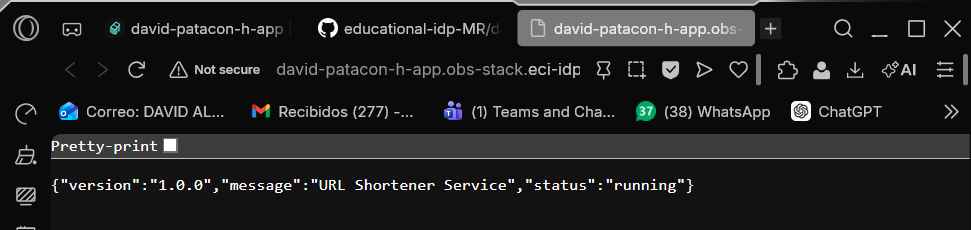
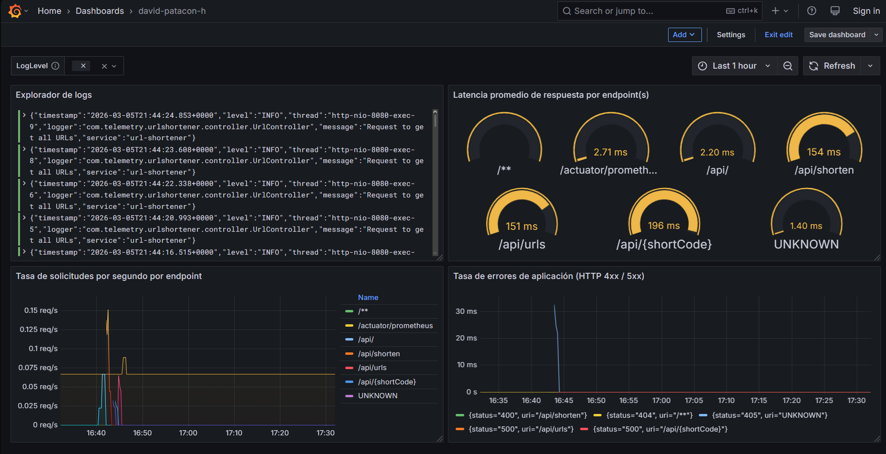
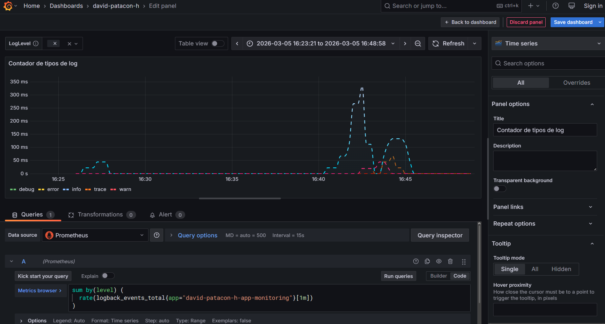
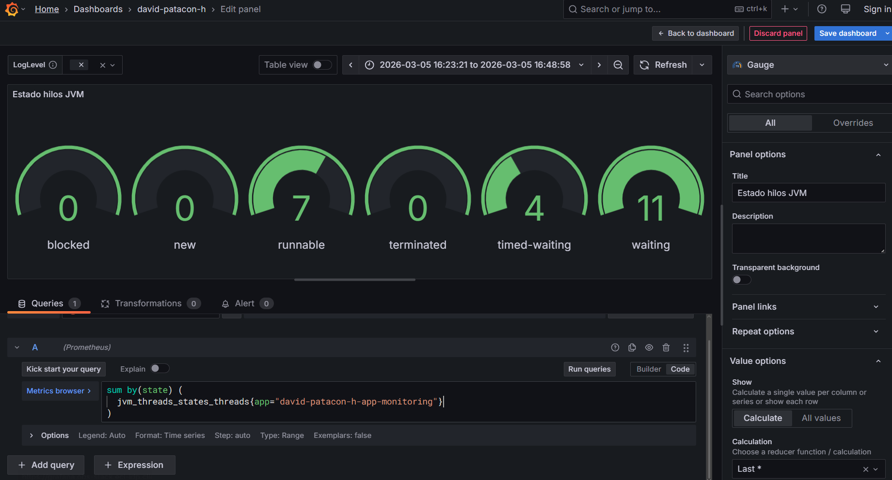
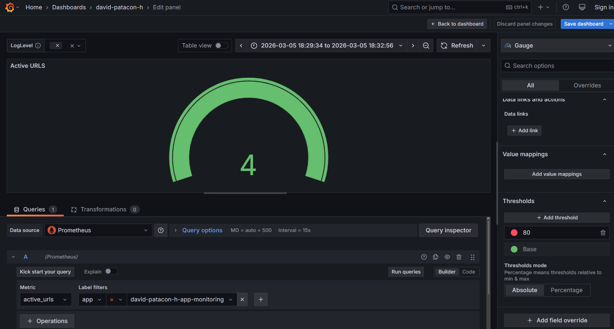

# Bitácora Experimento - Observabilidad y Monitoreo

**Nombre del estudiante:** _____________________________  
---
Cuando acabes no olvides ayudarnos evaluando tu ⭐[experiencia](https://forms.office.com/r/JCyhCpujrt)⭐
---

## Tabla de Contenidos
- [Etapa 1: Preparación del Ambiente](#etapa-1-preparación-del-ambiente)
- [Etapa 2: Métricas Iniciales](#etapa-2-métricas-iniciales)
- [Etapa 2.1: Dashboard Base en Grafana](#etapa-21-dashboard-base-en-grafana)
- [Etapa 2.2: Propuesta de Métrica Personalizada](#etapa-22-propuesta-de-métrica-personalizada)
- [Etapa 3: Experimentación y Análisis del Sistema](#etapa-3-experimentación-y-análisis-del-sistema)

---

## Etapa 1: Preparación del Ambiente

### 1.1. Información de la aplicación

### 1.2. Verificación del despliegue

**¿La aplicación se desplegó correctamente?** 

- [X] Sí
- [ ] No

**Captura de pantalla de la aplicación funcionando:**



### 1.3. Observaciones y problemas encontrados (opcional)

```


```

---

## Etapa 2: Métricas Iniciales

### 2.0.1. Generación de tráfico

**Endpoints probados:**

- [X] `GET /api/`
- [X] `POST /api/shorten`
- [X] `GET /api/{shortCode}`
- [X] `GET /api/urls`


### 2.0.2. Análisis de dos métricas relevantes

#### Métrica 1

**Nombre de la métrica:**  
```
http_server_requests_seconds_max 
```

**Tipo de métrica:** 
- [ ] Counter
- [X] Gauge 
- [ ] Histogram 
- [ ] Summary

**Descripción de qué información aporta:**
```
Esta metrica aporta el tiempo maximo que se demora en mandar una URL
Muestra un conjunto de peticiones realizadas y muestra la informacion para cada una 

```

**Relación con otras métricas (si aplica):**
```

```

**¿En que escenarios puede ayudar esta métrica?**
```
En el caso que quisiera disminir el tiempo de respuesta el enviar peticion es y optimizar el sistema esta metrica seria de utilidad


```

**¿Qué etiquetas (labels) se utilizan para agrupar los datos?**
```
error, exception, method, outcome, status, uri

```

---

#### Métrica 2

**Nombre de la métrica:**  
```
tomcat_sessions_expired_sessions_total
```

**Tipo de métrica:** 
- [x] Counter
- [ ] Gauge 
- [ ] Histogram 
- [ ] Summary

**Descripción de qué información aporta:**
```
Esta metrica aporta la cantidad de sesiones expiradas del servidor tomcat


```

**Relación con otras métricas (si aplica):**
```
Ejemplo: Un aumento en peticiones HTTP podría influir en el uso de CPU


```

**¿En que escenarios puede ayudar esta métrica?**
```
Esta metrica podria ayudar a identificar si por algun error en el sistemas expiraron muchas sesiones


```

**¿Qué etiquetas (labels) se utilizan para agrupar los datos?**
```
no tiene


```

---

## Etapa 2.1: Dashboard Base en Grafana


### 2.1.1. Evidencia: Dashboard Base en Grafana con los 4 paneles iniciales

**Captura de pantalla del dashboard:**



### 2.1.2. Visualizaciónes Adicionales (Con las metricas actuales)

#### Visualización Adicional 1

**Propósito:**
```
Quiero mostrar la cantidad de tipos de logs generados en un periodo de tiempo


```

**Título del panel:**
```
Contador tipos de logs
```

**Consulta (PromQL o LogQL):**
```
sum by(level) (
  rate(logback_events_total{app="david-patacon-h-app-monitoring"}[1m])
)

```

**Tipo de visualización:** 
- [x] Time series
- [ ] Gauge
- [ ] Bar chart
- [ ] Stat
- [ ] Logs
- [ ] Otro: _____

**Otros ajustes aplicados (colores, unidades, etc.) (opcional):**
```
Agrege colores, tipo de linea, unidades en segundos y detalles visuales

```

**Captura de pantalla:**

**Análisis (2-3 frases):**
```
Esta grafica nos inidca que la mayoria de logs fueron solo de infomarcion e hubieron pocos errores.


```

---

#### Visualización Adicional 2

**Propósito:**
```
Su utilidad es monitorear el comportamiento de los threads de la aplicación para detectar problemas de rendimiento, bloqueos o saturación.


```

**Título del panel:**
```
Estado hilos JVM
```

**Consulta (PromQL o LogQL):**
```
sum by(state) (
  jvm_threads_states_threads{app="david-patacon-h-app-monitoring"}
)

```

**Tipo de visualización:** 
- [ ] Time series
- [x] Gauge
- [ ] Bar chart
- [ ] Stat
- [ ] Logs
- [ ] Otro: _____

**Otros ajustes aplicados (colores, unidades, etc.) (opcional):**
```


```

**Captura de pantalla:**



**Análisis (2-3 frases):**
```
Se puede observar que 7 hilos estan en runnable, 4 en timed-waiting y 11 esperando


```

---

### 2.1.3. Análisis final del dashboard

**¿Qué otros datos te gustaría visualizar si tuvieras más información disponible?**
```

Me gustaria informacion sobre la cantidad de usuarios que hacen peticiones concurrentes y logs relacionados a posibles errores de concurrencia

```

---

## Etapa 2.2: Propuesta de Métrica Personalizada


### Análisis y propuesta de la métrica propia (en Java)

**1. Nombre de la métrica:**
```
active_urls

```

**2. Tipo de métrica:**
- [ ] Counter
- [X] Gauge

**3. ¿Qué comportamiento mide?**
```
Mide el número actual de URLs acortadas que están almacenadas en memoria en el mapa

```

**4. ¿Por qué es relevante para el sistema?**
```
Permite conocer la carga actual del servicio de acortamiento.

```


---

### Visualización en Grafana

**1. ¿Qué tipo de panel usaste en Grafana?**

- [ ] Time series  
- [x] Gauge  
- [ ] Stat  
- [ ] Bar chart  
- [ ] Otro: _____

**2. ¿Qué consulta PromQL vas a utilizar?**
```promql
active_urls{app="david-patacon-h-app-monitoring"}
```

**3. ¿Cuál es el propósito de la visualización?**
```
Mostrar en tiempo real cuántas URLs acortadas hay almacenadas en el sistema.

```

---

### Panel creado en Grafana

**Captura de pantalla del panel en Grafana:**



---

## Etapa 3: Experimentación y Análisis del Sistema

### 3.1. Detección de anomalías y puntos de interés

**1. Como describirias la anomalía?**

```


```

**2. Que paneles te ayudaron a identificarlo?**

``` 


```

**3. Cual podria ser la causa de la anomalía?**

``` 


```

**Captura de pantalla del dashboard mostrando la anomalía:**

> _[Inserta aquí la imagen]_

---

### 3.2. Intento de corrección de anomalías


#### 3.2.1. Modificación del código

**Descripción del ajuste realizado:**
```
Describe en pocas palabras el ajuste realizado.


```

#### 3.2.2. Resultados después del despliegue

**¿El ajuste surtió efecto?**
- [ ] Sí 
- [ ] No 
- [ ] Parcialmente


**Captura de pantalla del dashboard después del ajuste:**

> _[Inserta aquí la imagen del estado del dashboard posterior al ajuste]_

---

### 5.7. Reflexión final

**¿Qué panel te resultó más útil para detectar problemas?**
```


```

**¿Qué métrica aporta mayor valor para monitorear un sistema real?**
```


```

**¿Qué agregarías o mejorarías en tu dashboard?**
```


```

**Fin de la bitácora**
